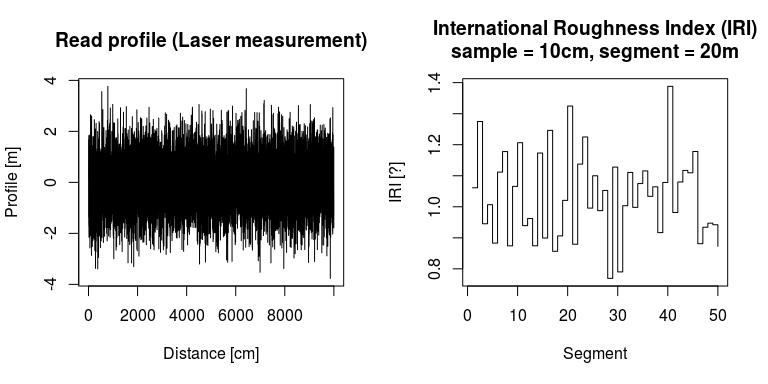

<!-- README.md is generated from README.Rmd. Please edit that file -->
rroad R package
===============

Set of tools for monitoring road condition

-   International Roughness Index (IRI) computation

[](https://travis-ci.org/vsimko/rroad) [](https://codecov.io/github/vsimko/rroad?branch=master)

Download and Install
--------------------

To download the development version of the package, type the following at the R command line:

``` r
install.packages("devtools")
devtools::install_github("vsimko/rroad")
```

Examples
--------

``` r
profile <- rnorm(10000)
iri <- CalculateIRI(profile, IRI_COEF_100, 20)
par(mfrow = c(1,2)) # space for two diagrams
plot(profile, type="l",
  xlab="Distance [dm]", ylab="Profile [mm]",
  main="Read profile (Laser measurement)")
plot(iri, type="s",
  xlab="Segment", ylab="IRI [m/km]",
  main="International Roughness Index (IRI)\nsample = 10cm, segment = 20m")
```

<!-- -->

References
----------

<a id="Sayers1986"/> Sayers, M.W., Gillespie, T.D. & Queiroz, C. a V., 1986. **The International Road Roughness Experiment - Establishing Correlation and a Calibration Standard for Measurements**. Washington, D.C.: Transportation Department.
