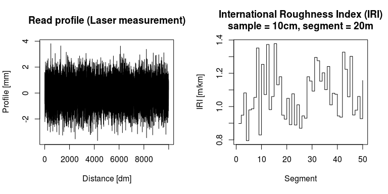

<!-- README.md is generated from README.Rmd. Please edit that file -->
rroad R package
===============

Set of tools for monitoring road condition.

Currently, the following features are supported:

-   International Roughness Index (IRI) computation
    -   continuously increasing segment
    -   fixed length overlapping segments with an offset

[](https://travis-ci.org/vsimko/rroad) [](https://codecov.io/github/vsimko/rroad?branch=master) [](http://cran.r-project.org/package=rroad) [](https://dependencyci.com/github/vsimko/rroad)

Download and Install
--------------------

To download the development version of the package, type the following at the R command line:

``` r
install.packages("devtools")
devtools::install_github("vsimko/rroad")
```

To download the release version of the package on CRAN, type the following at the R command line:

``` r
install.packages("corrplot")
```

Examples
--------

``` r
profile <- rnorm(10000)
iri <- CalculateIRIperSegments(profile, IRI_COEF_100, 20)
par(mfrow = c(1,2)) # space for two diagrams
plot(profile, type = "l",
  xlab = "Distance [dm]", ylab = "Profile [mm]",
  main = "Read profile (Laser measurement)")
plot(iri, type = "s",
  xlab = "Segment", ylab = "IRI [m/km]",
  main = "International Roughness Index (IRI)\nsample = 10cm, segment = 20m")
```



References
----------

<a id="Sayers1986"/> Sayers, Michael W; Gillespie, Thomas D; Queiroz, Cesar A.V. 1986 **The International Road Roughness Experiment (IRRE) : establishing correlation and a calibration standard for measurements**. World Bank technical paper ; no. WTP 45. Washington, DC : The World Bank. [Link](http://documents.worldbank.org/curated/en/326081468740204115/The-International-Road-Roughness-Experiment-IRRE-establishing-correlation-and-a-calibration-standard-for-measurements)
