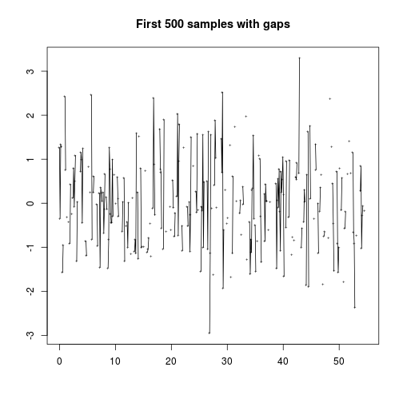

<!--
%\VignetteEngine{knitr::docco_linear}
%\VignetteIndexEntry{Road Condition Analysis}
-->

An Introduction to **rroad** Package
=======================================


First, some assumptions about the road and our car:

```r
road_len_m <- 1000          # road length
speed_kmh <- 80             # car speed in km/h
sample_rate_hz <- 200       # sampling rate of the 3D accelerometer
speed_ms <- speed_kmh / 3.6 # car speed in m/s
sample_len <- round(speed_ms / sample_rate_hz, digits = 2) # sample size
num_samples <- round(road_len_m / sample_len) # how many samples we collected
GRAVITY_ACCEL <- 9.80665 # ms^-2

print(sample_len)
```

```
## [1] 0.11
```

```r
print(num_samples)
```

```
## [1] 9091
```

First, we use some sample data obrained from a 3D-accelerometer. We need to trim
NA valued from the signal, because there might be gaps (NA values) and the
interpolation doesn't work with NAs.


```r
# random signal with simulated gravity
random_accz <- (rnorm(num_samples) - GRAVITY_ACCEL)

# random gaps in the signal to later demonstrate gaps interpolation
random_gaps <- sapply(rnorm(num_samples),
                      function(x){ifelse(abs(x) > .7, 1, NA)})

signal <- data.frame(
  sampleid = seq_len(num_samples),
  dist_meters = seq(from = 0, to = road_len_m, by = sample_len),
  accZ = random_accz * random_gaps
)
signal$accZ %>% head(num_samples) -> signal$accZ_orig

plot(signal$dist_meters, signal$accZ, type = "o", pch = "+", cex = .5,
     main = "Accelerometer signal (original)",
     xlab = "Distance traveled [m]",
     ylab = expression( paste("Z-acceleration [", m * s ^ -2, "]") ))
```


```r
# signal without the standard gravity acceleration
(signal$accZ_orig - GRAVITY_ACCEL) -> signal$accZ_nogravity

# z-score normalization (subtracting mean and dividing by sd)
signal$accZ_orig %>% scale -> signal$accZ

# removing leading and trailing NAs in the whole matrix
signal %>% na.trim -> signal

plot(signal$dist_meters, signal$accZ, type = "o", pch = "+", cex = .5,
     main = "Accelerometer signal (z-score normalized)",
     xlab = "Distance traveled [m]",
     ylab = expression( paste("Z-acceleration [", m * s ^ -2, "]") ))
```


Now, we look at the gaps closely:

```r
signal %>% head(500) -> signal_head
plot(signal_head$dist_meters, signal_head$accZ,
     type = "o", xlab = NA, ylab = NA, pch = "+", cex = .5,
     main = paste("First", nrow(signal_head), "samples with gaps"))
```


We need to interpolate the values between the gaps:

```r
signal$accZ %>% na.approx(na.rm = FALSE) -> signal$accZ_approx

signal %>% head(500) -> signal_head
plot(signal_head$dist_meters, signal_head$accZ,
     type = "p", pch = "+", cex = .5, xlab = NA, ylab = NA,
     main = paste("First", nrow(signal_head), "samples interpolated"))

lines(signal_head$dist_meters, signal_head$accZ_approx,
       col = "red", pch = ".", xlab = NA, ylab = NA)
```



We can also analyze frequency content of the signal by using **Continuous 
Wavelet Transform (CWT)**. The following plot is called "scaleogram".


```r
w <- wt(cbind(signal$sampleid, signal$accZ_approx), dj = 1/2)
plot(w)
```


We can extract the CWT coeficients representing certaing frequency bands.
The `power.corr` matrix represents bias-correction version.

```r
nscales <- nrow(w$power.corr)
signal$cwt_mid  <- w$power.corr[floor(.5 * nscales),]
signal$cwt_high <- w$power.corr[floor(.2 * nscales),]
signal$cwt_low  <- w$power.corr[floor(.8 * nscales),]

plot(signal$cwt_high, type = "l")
lines(signal$cwt_mid, col = "blue", lw = 4)
lines(signal$cwt_low, col = "red", lw = 4)
```


Here, we compute moving average and root mean squared value:


```r
signal$accZ_approx %>% rollmean(k = 10, fill = NA) -> signal$rollmean10
signal$accZ_approx %>% rollmean(k = 20, fill = NA) -> signal$rollmean20

rms <- function(x) sqrt(mean(x^2)) # same as `rms` from `seewave` package
signal$accZ_approx %>% rollapply(width = 20, fill = NA, FUN = rms ) -> signal$rms20
```


```r
signal %>% head(3000) -> signal_head

plot(signal_head$dist_meters,
     signal_head$accZ_approx,
     type = "l", xlab = NA, ylab = NA,
     main = paste("First", nrow(signal_head), "samples interpolated"))

lines(signal_head$dist_meters, signal_head$rollmean10, col = "red", lw = 3)
lines(signal_head$dist_meters, signal_head$rollmean20, col = "blue", lw = 3)
lines(signal_head$dist_meters, signal_head$rms20, col = "green", lw = 3)
```


